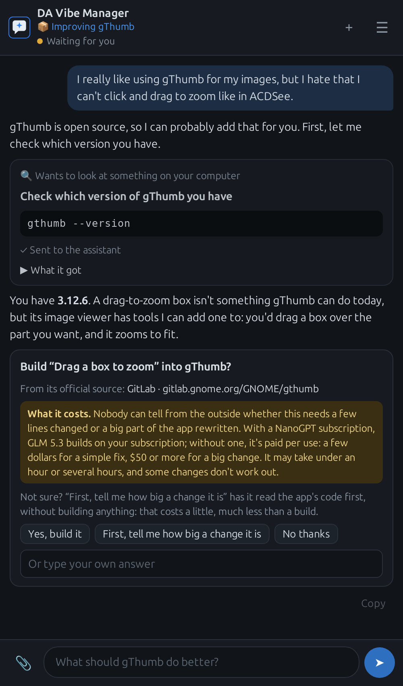

# DA Vibe Manager

A package manager for vibe-coded apps. Tell it what you wish an open-source app could do, and
an AI builds you a version that does it. Then it keeps that app up to date like any other
software: when the project releases a new version, your changes are carried over to it and it's
rebuilt, at a time you choose.

> [!WARNING]
> **Beta.** DA Vibe Manager is beta software: expect rough edges, and use it at your own risk.
> Read every command it asks to run, and every change it hands you, before you say yes.



## What it does

- **Builds the change you want into an app you use.** The AI (Claude Code, on a NanoGPT model)
  works in a sealed Podman sandbox on your computer: it reads the app's code, makes the change,
  builds it and tests it there, then hands you an AppImage to try and install next to your own
  copy.
- **Keeps it up to date.** Every app is the project's official release with your changes on
  top. When a new version comes out, DA Vibe Manager carries your changes over and rebuilds it by
  itself, at a quiet time you choose, and the AI only steps in if a change no longer fits.
- **Asks before it touches your computer.** The AI can't see your files or run anything on your
  computer. When it needs to look at something, it shows you the exact command; nothing runs
  until you click, and you decide what it gets to see of the output.
- **Gets apps working here.** If an app it built won't start or misbehaves on your computer, it
  helps find out why, and fixes the build.
- **Shares.** An app can go to a friend as a small `.vibe` file of your changes, which their
  computer builds from the official source, or as an AppImage to just run.

The [manual](MANUAL.md) covers everything else: how a build goes, what it costs, updates,
sharing, backups and how it keeps your computer safe.

## Install

Releases come as a single **AppImage** for x86-64 Linux: download it from
[Releases](https://github.com/DigitalArchon/DAVibeManager/releases), make it executable and run it.

```bash
chmod +x DAVibeManager-*-x86_64.AppImage
./DAVibeManager-*-x86_64.AppImage
```

Or add it with Gear Lever (or Shelly on CachyOS) to get it in your apps menu. It needs Ubuntu
24.04 / Mint 22, Debian 13, or a current Fedora, Arch or CachyOS, with rootless **Podman** for
the sandbox and **WebKitGTK** for its window:

| Distribution | |
|---|---|
| Ubuntu, Mint, Debian | `sudo apt install podman gir1.2-webkit2-4.1` |
| Fedora | `sudo dnf install podman webkit2gtk4.1` |
| Arch, CachyOS | `sudo pacman -S podman passt webkit2gtk-4.1` |

If Podman is missing, the first screen offers to install it for you. Then paste your
[NanoGPT](https://nano-gpt.com) API key, and the first start prepares the sandbox, which takes a
few minutes. Set a spending limit on the key: building an app can cost from a few dollars to
$50 or more on a model paid per use.

Every release can be rebuilt from its commit to the same bytes: see
[packaging/README.md](packaging/README.md). To run it from source instead, see the
[manual](MANUAL.md#running-from-source).

## Security

Please report vulnerabilities privately as described in [SECURITY.md](SECURITY.md), not in a
public issue.

## Licence

AGPL-3.0-or-later. See [LICENSE](LICENSE). Vendored libraries:
[src/davibemanager/web/vendor/NOTICE](src/davibemanager/web/vendor/NOTICE).
